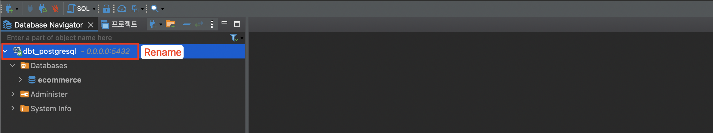

# PostgreSQL 설치

```bash
docker-compose up -d
docker ps
# password : Admin1234
docker exec -it dbt_postgres psql -U admin -d ecommerce
```

DBeaver 접속




DBeaver 에서 `sample_data.sql` 실행


데이터 발생
```bash
python gen_data.py
```


주문 데이터 확인


accesslog 확인
```bash
tail -f accesslog/access.log.*
```
